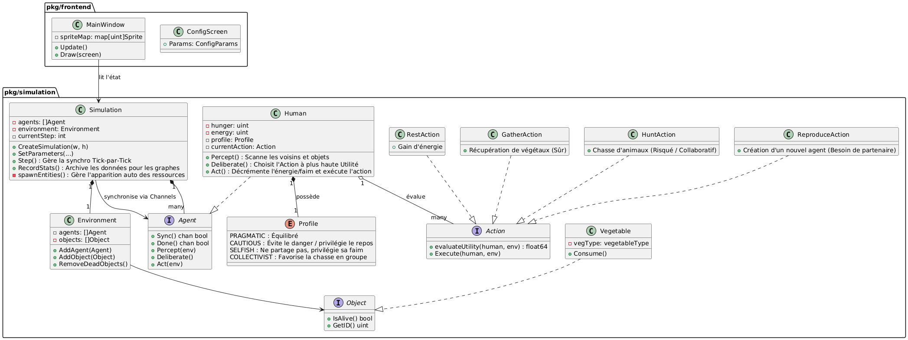
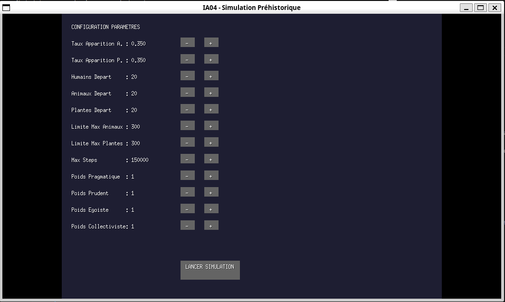
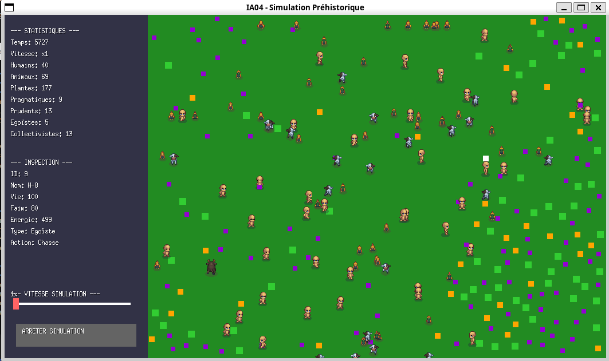
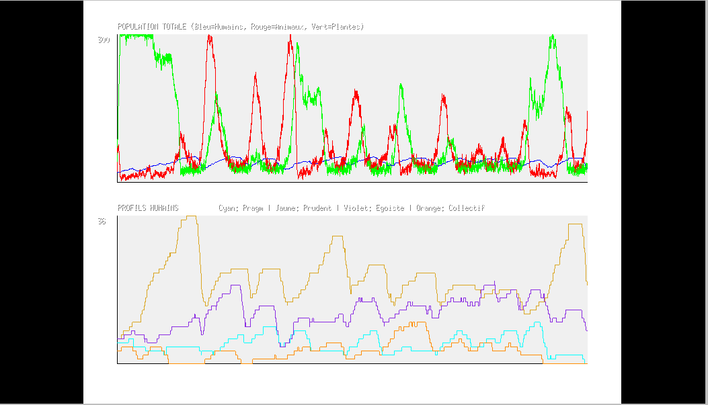

# 🦖 Simulation Multi-Agents : Tribu Préhistorique (UV IA04)

## 📄 Introduction

Ce projet a été réalisé dans le cadre de l'UV **IA04**. Il s'agit d'une simulation de vie artificielle mettant en scène une tribu préhistorique luttant pour sa survie dans un environnement hostile et dynamique.

La particularité de ce système réside dans son architecture **multi-agents** : chaque humain, animal et plante est une entité indépendante. Les humains, en particulier, sont dotés de profils psychologiques distincts qui influencent leurs décisions via un système d'utilité :

* **🛡️ Prudent :** Privilégie la sécurité, la santé et évite les risques.
* **🤝 Collectiviste :** Favorise la coopération (chasse en groupe) et la reproduction.
* **👤 Égoïste :** Priorise sa propre survie alimentaire immédiate, évite le partage.
* **⚖️ Pragmatique :** Adopte une approche équilibrée selon la situation.

Chaque agent s'exécute dans sa propre **Goroutine**, rendant la simulation hautement concurrente.



---

## 🚀 Guide de Démarrage Rapide

### Prérequis
* **Go :** Version 1.18 ou supérieure.
* **Ebiten v2 :** Moteur graphique utilisé pour la visualisation.

### Installation et Lancement

1.  **Cloner le dépôt :**
    ```bash
    git clone https://github.com/MaximeGautrot/IA04-Projet
    cd IA04-Projet
    ```

2. **Aller dans le dossier code:**
    ```bash
    cd code
    ```

3.  **Télécharger les dépendances :**
    ```bash
    go mod tidy
    ```

4.  **Vérifier les ressources :**
    Assurez-vous que le dossier `images/` existe à la racine et contient les assets graphiques nécessaires 

5.  **Lancer la simulation :**
    ```bash
    go run cmd/main.go
    ```

---

## 🎮 Instructions d'Utilisation

### 1. Configuration Initiale
Au lancement, un écran de paramétrage vous permet de définir les conditions initiales de la simulation.



* **Population Initiale :** Réglez le nombre d'humains, d'animaux et de plantes au départ.
* **Taux d'Apparition (Lambda) :** Contrôlez la fréquence de réapparition des ressources (Animaux/Plantes) -> Selon un processus de poisson.
* **Poids des Profils :** Définissez la répartition psychologique de la tribu selon des poids pour chaque.
* **Les Maximum :** Changer les maximum (nombre d'animaux; végétaux et le nombre de steps/ticks maximum).

### 2. Interface de Simulation
Une fois la simulation lancée :

* **Contrôle du Temps :** Utilisez le slider en bas à gauche pour accélérer (de x1 à x100) ou ralentir la simulation.
* **Arrêt :** Le bouton permet d'arrêter la simulation et d'afficher le graphique des résultats.

* **Attention:** Il faut fermer la fenêtre du graphique et redémarrer la simulation dans le terminal pour en faire une nouvelle.

### 3. Inspection des Agents
Cliquez sur n'importe quel agent humain dans la fenêtre permet d'afficher ses détails dans la barre latérale ("Inspection"). Vous pouvez le suivre grâce au carré blanc au dessus de sa tête.

* **Informations basiques:** Nom et ID.
* **État Vital :** Faim, Énergie, Santé.
* **Psychologie :** Profil de l'individu (ex: Prudent).
* **Action en cours :** Ce que l'agent est en train de faire (Chasser, Dormir, Se reproduire...).



---

## ⚙️ Détails Techniques Simplifiés

### Architecture des Données
Le projet repose sur quelques structures clés :

* **`Environment` :** Contient les listes d'agents et d'objets. C'est l'espace partagé.
* **`Agent` (Interface) :** Définit les méthodes obligatoires (`Percept`, `Deliberate`, `Act`, `Start`).
* **`Human` (Struct) :** Implémente l'agent. Possède une goroutine dédiée, un profil psychologique et des états (faim, énergie).
* **`Simulation` :** Le chef d'orchestre qui gère le cycle de vie global (les "Ticks").

### La Barrière de Synchronisation (Concurrency)
Pour garantir que tous les agents agissent de manière cohérente au même "tour" (Tick), nous utilisons un pattern de barrière avec des **Channels Go** :

1.  **Sync :** Au début d'un tick, la Simulation envoie un signal sur le channel `Sync` de chaque agent.
2.  **Goroutine Agent :** L'agent perçoit, réfléchit et agit, puis envoie un signal sur son channel `Done`.
3.  **Wait :** La Simulation attend de recevoir tous les signaux `Done` avant de passer au tick suivant.

### Sécurité des Données (`sync.RWMutex`)
L'environnement étant partagé par des centaines de goroutines (lectures par les agents, écriture par la simulation), l'accès aux listes d'agents est protégé par un `sync.RWMutex`. Cela permet de nombreuses lectures simultanées (vision des agents) tout en bloquant lors des modifications.

---

## 🧠 Intelligence Artificielle

Le comportement des agents suit une boucle classique **PDA** :

1.  **Perception (`Percept`) :** L'agent scanne son environnement dans un rayon défini (`VisionRadius`). Il filtre les objets (végétaux) et les autres agents (animaux, humains).
2.  **Délibération (`Deliberate`) :**
    * L'agent évalue l'**utilité** de chaque action possible (Ceuillir, Dormir, Chasser, Se Reproduire).
    * Cette utilité est modifiée par son **Profil**.
    * *Exemple :* Un agent `Prudent` donnera un score d'utilité très faible à la chasse si sa santé n'est pas à 100%, alors qu'un `Pragmatique` le fera s'il a faim.
3.  **Action (`Act`) :** L'action ayant le score le plus élevé est exécutée (déplacement, consommation de ressources, etc.).

---

## 📊 Analyse et Résultats


*(Exemple de graphiques montrant l'évolution des populations)*